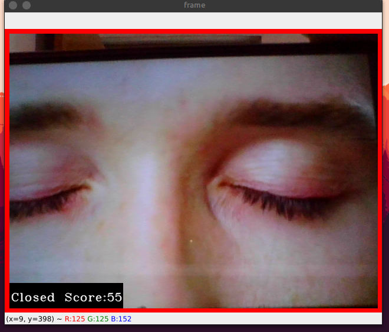
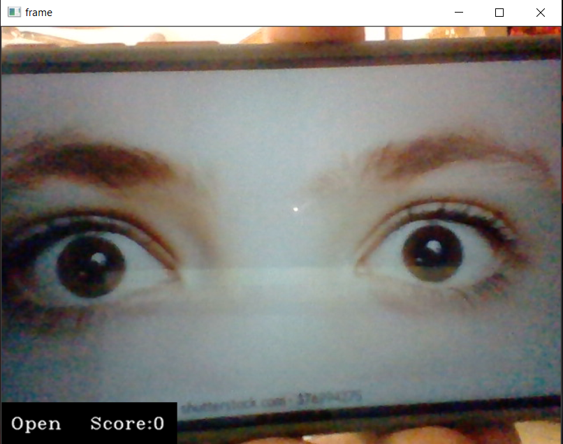

# Driver-Drowsiness-Detection-System
The objective of this intermediate Python project is to build a drowsiness detection system that will detect that a person’s eyes are closed for a few seconds. This system will alert the driver when drowsiness is detected.

## Used Technologies : 
- **Python**
- **OpenCV** – `pip install opencv-python` (face and eye detection).
- **TensorFlow** – `pip install tensorflow` (keras uses TensorFlow as backend).
- **Keras** – `pip install keras` (to build our classification model).
- **Pygame** – `pip install pygame` (to play alarm sound).

## Steps to Run : 
- Download the **zip file** of this Project and Extract it
- Install all the required technologies by writing the commands given above in your command line
- Run the Project by the following line through command line :
	- `python "drowsiness detection.py"`

## Preview : 
 
